<div align="center">

# 🕷️ S.P.I.D.E.X.
### Spider Platform for Integrated Dynamic Engineering X-bot

**A 12-Servo, Bluetooth-Controlled, Bio-Inspired Quadruped Robot**

Built with Arduino Nano · Inverse Kinematics · HC-05 Bluetooth · Dual-Rail Power System

[](https://www.arduino.cc/)
[](#)
[](#license)

</div>

---

## 📖 Overview

**SPIDEX** is a compact, low-cost, untethered quadruped ("spider") robot built to demonstrate stable, adaptive locomotion across uneven terrain — something traditional wheeled robots struggle with. The robot uses a **12-servo actuation system** (3 servos per leg — coxa, femur, tibia) driven by an **Arduino Nano** running real-time **inverse kinematics**, and is wirelessly controlled over **Bluetooth (HC-05)** via a mobile app.

A key engineering focus of this project was solving the **power delivery problem**: running 12 servos simultaneously without brownouts or controller resets. This was solved using a **dual-rail power architecture** — a 7.4V Li-ion battery pack regulated through an **XL4016 buck converter** to a stable 6V servo rail, separate from the logic supply.

This project was developed as part of the course *21ECC301P – Microprocessor, Microcontroller and Interfacing Techniques*, Semester V (2025–26), Department of ECE, SRM Institute of Science and Technology.

<!-- 🖼️ IMAGE: Main hero shot of the finished robot. Place your file at images/SPIDEX_bot.jpg -->
<p align="center">
  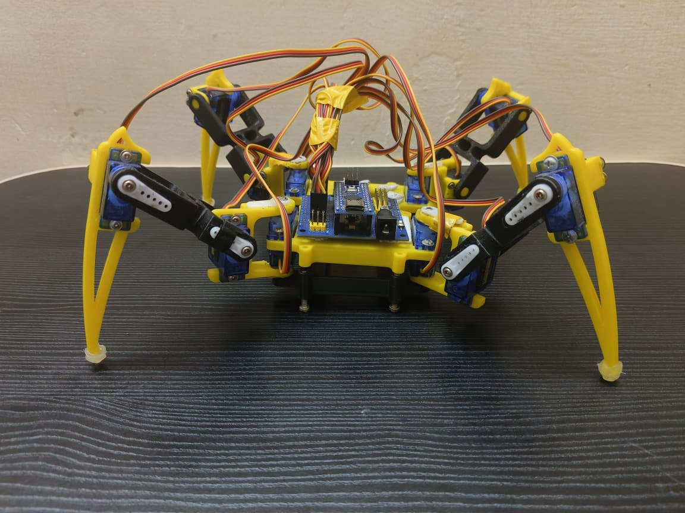
</p>

> Aligned with **SDG 9** (Industry, Innovation and Infrastructure) and **SDG 11** (Sustainable Cities and Communities), SPIDEX explores affordable, bio-inspired robotics for exploration and disaster-response applications.

---

## ✨ Features

- 🕸️ **12-DOF Quadruped Locomotion** — 3 servos per leg replicate arachnid joint movement
- 🧠 **Real-Time Inverse Kinematics** — Arduino Nano computes precise joint angles for each foot position
- 📱 **Wireless App Control** — Bluetooth (HC-05) interface, ~10–15 m reliable range
- 🔋 **Dual-Rail Power System** — 2S Li-ion + XL4016 buck converter prevents brownouts under high servo load
- 🚶 **Multiple Gaits** — Forward, Backward, Left Turn, Right Turn, and a "Hello" gesture
- 🖨️ **3D-Printed Chassis** — STL files included for full mechanical reproduction

---

## 🎯 Problem Statement

Wheeled robots are efficient on flat ground but fail on debris, stairs, rocky terrain, or uneven surfaces common in disaster zones and exploration sites. SPIDEX addresses this by implementing a bio-inspired, multi-legged locomotion platform — combining a 12-servo inverse-kinematics-driven leg system, Bluetooth wireless control, and a stable dual-rail power system — to bridge the gap between complex research-grade quadrupeds and accessible, educational robotics platforms.

## 🎯 Objectives

- Design and build a functional 12-servo quadruped robot capable of app-controlled wireless locomotion
- Implement robust inverse kinematics and Bluetooth communication for real-time control
- Engineer a stable dual-rail power system for reliable logic and high-current servo operation

---

## 🏗️ System Architecture

### Block Diagram

The system integrates four subsystems: power supply, control, communication, and actuation.

<!-- 🖼️ IMAGE: Figure 3.1 from report — overall hardware block diagram. Place at images/block_diagram.jpg -->
<p align="center">
  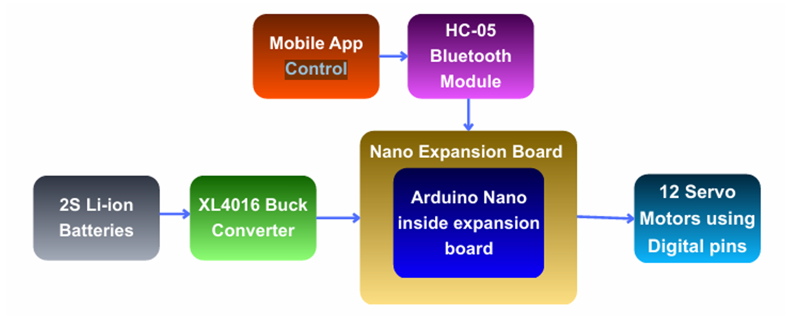
</p>

| Subsystem | Component | Role |
|---|---|---|
| Power Supply | 2S Li-ion Battery (7.4V) | Main energy source |
| Voltage Regulation | XL4016 Buck Converter | Steps down to stable 6V servo rail |
| Control | Arduino Nano (on expansion board) | Runs IK algorithm, generates PWM |
| Communication | HC-05 Bluetooth Module | Wireless serial link to mobile app |
| Actuation | 12× SG90 Servo Motors | 3 per leg (coxa, femur, tibia) |

### Circuit / Wiring Diagram

<!-- 🖼️ IMAGE: Your full circuit schematic. Place at images/circuit_diagram.jpg -->
<p align="center">
  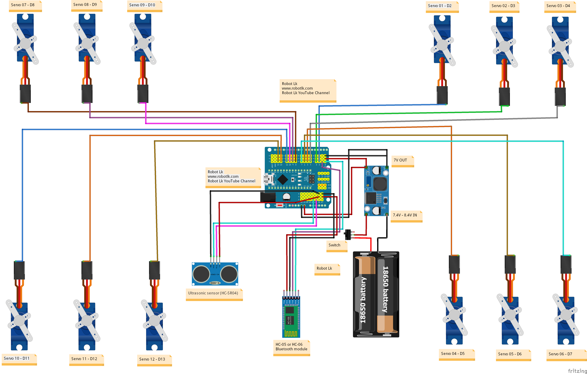
</p>

### Arduino Nano Pin Mapping

<!-- 🖼️ IMAGE: Figure 3.2 from report — Arduino Nano pin diagram. Place at images/pin_diagram.jpg -->
<p align="center">
  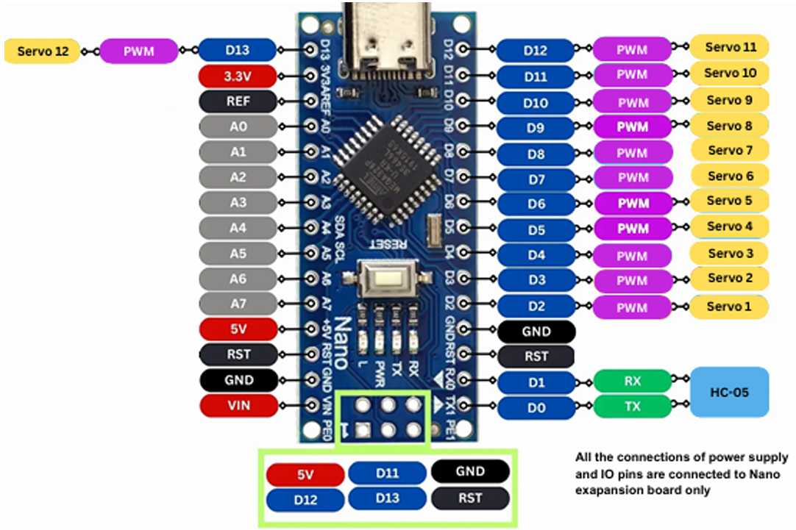
</p>

| Pin | Function | Pin | Function |
|---|---|---|---|
| D0 (RX) | Bluetooth RX (from HC-05 TX) | D8 | Servo 7 |
| D1 (TX) | Bluetooth TX (to HC-05 RX) | D9 | Servo 8 |
| D2 | Servo 1 | D10 | Servo 9 |
| D3 | Servo 2 | D11 | Servo 10 |
| D4 | Servo 3 | D12 | Servo 11 |
| D5 | Servo 4 | D13 | Servo 12 |
| D6 | Servo 5 | 5V / VIN / GND | Power distribution |
| D7 | Servo 6 | A0–A7 | Reserved for future sensors |

### System Flow Diagram

<!-- 🖼️ IMAGE: Figure 3.3 from report — end-to-end signal/power flow. Place at images/flow_diagram.jpg -->
<p align="center">
  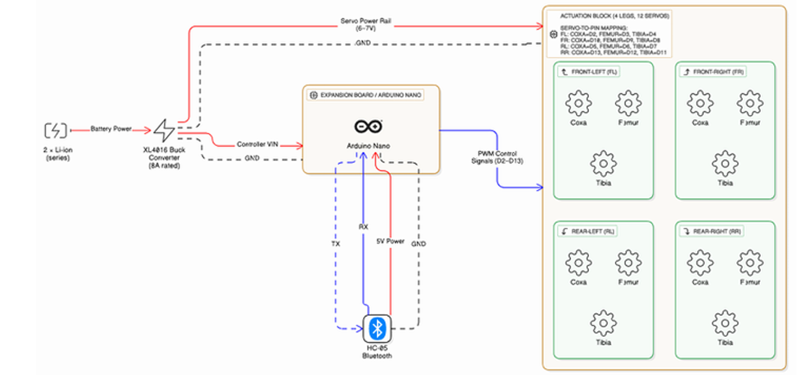
</p>

---

## 🦿 Kinematics & Calibration

Each leg has 3 degrees of freedom (X/Y/Z), with every servo ranging from 0°–180° and a neutral resting position at 90°. All servos must be calibrated to neutral before running any gait sequence.

<!-- 🖼️ IMAGE: Figure 3.4 from report — kinematics axes + calibration example. Place at images/kinematics_diagram.jpg -->
<p align="center">
  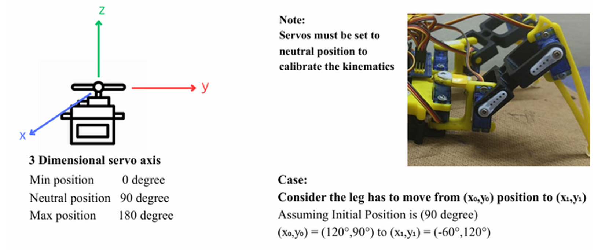
</p>

**Inverse Kinematics equations** used per leg:

```
x = L1·cos(θ1) + L2·cos(θ1 + θ2)
y = L1·sin(θ1) + L2·sin(θ1 + θ2)
```

Where `L1, L2` are the femur/tibia link lengths and `θ1, θ2` are the coxa/femur joint angles. The Arduino Nano rearranges these equations to compute the required servo angle for any target foot coordinate in real time.

---

## 🛠️ Tools & Software Used

| Category | Tool | Purpose |
|---|---|---|
| Microcontroller IDE | Arduino IDE | Writing/compiling/uploading firmware |
| Programming Language | C/C++ | Inverse kinematics & control logic |
| Robotics Library | `Servo.h` | PWM signal generation for 12 servos |
| Communication | Mobile Bluetooth RC App | Sends F/B/L/R/Stop commands to HC-05 |
| Mechanical Design | Fusion 360 / SolidWorks | Chassis & leg segment design (STL export) |

---

## 📁 Repository Structure

```
SPIDEX/
├── images/                                  # All diagrams & photos used in this README
├── Basic_repetitive_movements_code/         # Baseline gait test sketches
├── Basic_position_of_servo_motors_Robot_Lk/ # Servo neutral/position calibration code
├── Bluetooth-controlling_spider_robot_Robot_Lk/ # Main Bluetooth gait control firmware
├── 3D_parts_STL_files/                      # Printable chassis & leg STL files
├── docs/
│   └── BATCH_3_SPIDEX_MAIN_REPORT.pdf       # Full project report
└── README.md
```

---

## 🎥 Results & Demonstration

The robot was tested for forward, backward, turning, and gesture-based movement — all under live Bluetooth control.

<table>
<tr>
<td align="center">
<!-- 🖼️ IMAGE: Figure 4.2 — Top view, initial neutral (90°) calibration position. Place at images/top_view.jpg -->
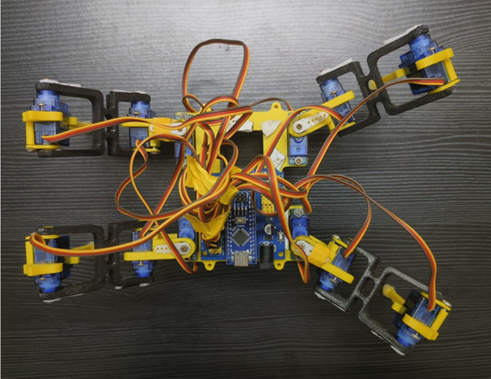<br><b>Top View — Neutral Calibration</b>
</td>
<td align="center">
<!-- 🖼️ IMAGE: Figure 4.3 — Forward gait. Place at images/forward_movement.jpg -->
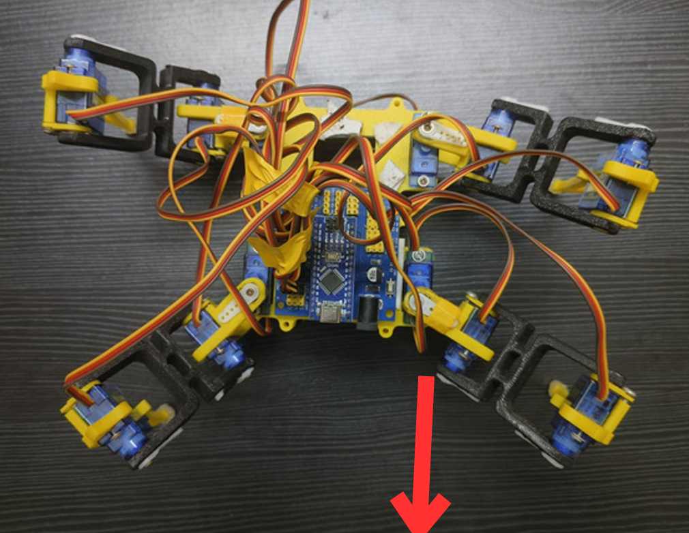<br><b>Forward Movement</b>
</td>
</tr>
<tr>
<td align="center">
<!-- 🖼️ IMAGE: Figure 4.4 — Backward gait. Place at images/backward_movement.jpg -->
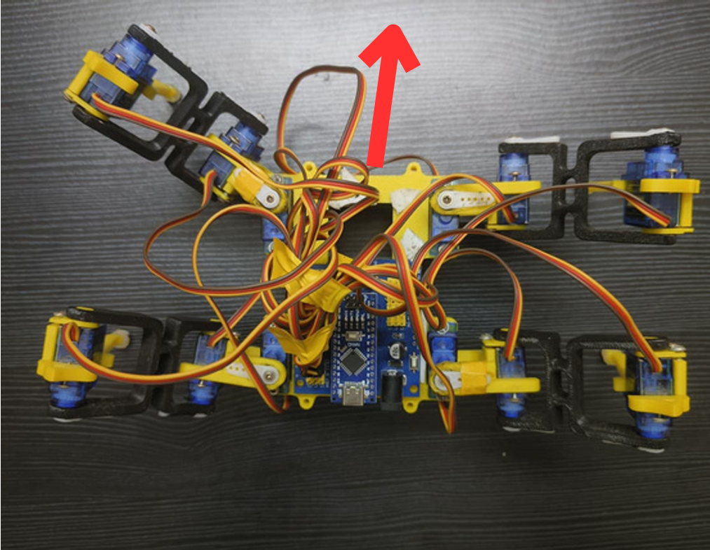<br><b>Backward Movement</b>
</td>
<td align="center">
<!-- 🖼️ IMAGE: Figure 4.5 — Right turn. Place at images/right_turn.jpg -->
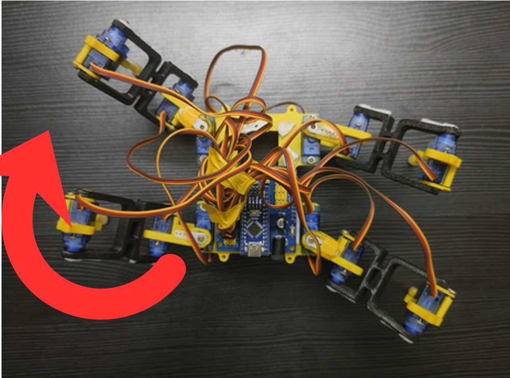<br><b>Right Turn</b>
</td>
</tr>
<tr>
<td align="center">
<!-- 🖼️ IMAGE: Figure 4.6 — Left turn. Place at images/left_turn.jpg -->
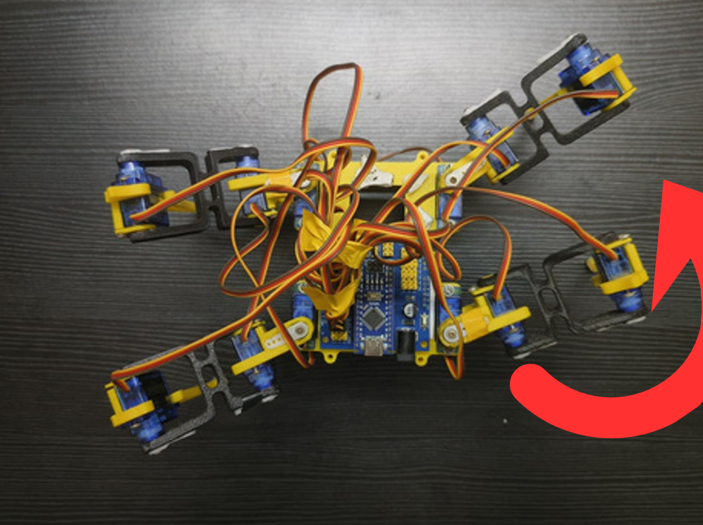<br><b>Left Turn</b>
</td>
<td align="center">
<!-- 🖼️ IMAGE: Figure 4.1 — Front view of assembled robot. Place at images/front_view.jpg -->
<br><b>Front View</b>
</td>
</tr>
</table>

### Experimental Test Results

| Test Case | Condition | Observation | Result |
|---|---|---|---|
| Forward Motion | All 4 legs cyclic, synchronized | Smooth gait, minimal jitter | ✅ Successful |
| Reverse Motion | Opposite gait sequence | Stable backward motion | ✅ Successful |
| Side Walk | Alternate diagonal legs | Balanced, minor delay at extreme angles | ✅ Successful |
| Turning (L/R) | Diagonal pairs alternated | Smooth turn, no tilt | ✅ Successful |
| "Hello" Gesture | One leg raised, 3-servo coordination | Accurate, stable positional control | ✅ Successful |

**Key metrics:** Bluetooth range ~10–15 m · No controller brownouts under full servo load · Real-time, lag-free command response

---

## 🚀 Getting Started

1. **Hardware**: Assemble the chassis using the STL files in `3D_parts_STL_files/`, wire according to the [pin mapping](#arduino-nano-pin-mapping) and [circuit diagram](#circuit--wiring-diagram).
2. **Calibrate**: Flash `Basic_position_of_servo_motors_Robot_Lk/` first and set all 12 servos to their 90° neutral position.
3. **Test Gaits**: Flash `Basic_repetitive_movements_code/` to validate individual leg motion.
4. **Full Control**: Flash `Bluetooth-controlling_spider_robot_Robot_Lk/`, pair the HC-05 module with a Bluetooth RC app, and control SPIDEX using F/B/L/R/Stop commands.

---

## 🔮 Future Scope

- Closed-loop Model Predictive Control (MPC) for adaptive gait correction
- Sensor integration (ultrasonic/IMU) via the reserved A0–A7 analog pins
- Sample-based stochastic control for terrain-uncertainty robustness
- Autonomous, AI-assisted navigation

---

## 📚 References

Key literature that informed this design (full list in the [project report](docs/BATCH_3_SPIDEX_MAIN_REPORT.pdf)):

1. Cun et al., *"Model Predictive Optimization and Control of Quadruped Whole-Body Locomotion,"* IEEE/CAA JAS, 2025.
2. Li et al., *"Quadruped Robots: Bridging Mechanical Design, Control, and Applications,"* Robots (MDPI), 2025.
3. Garcia et al., *"OpenMutt: A Reconfigurable Quadruped Robot for Research and Education,"* IJMEE, 2024.
4. Turrisi et al., *"Sample-Based Stochastic Control Strategies for Quadrupedal Robots,"* arXiv, 2024.

---

## 👥 Authors

Developed under the guidance of **Dr. P. Eswaran**, Department of Electronics & Communication Engineering, SRM Institute of Science and Technology.

- Parnapalli Anish
- Tavishi Bhardwaj
- T. S. Kubera Vishnu

## 📄 License

This project is open-sourced for educational use. Add your preferred license (e.g., MIT) here.
